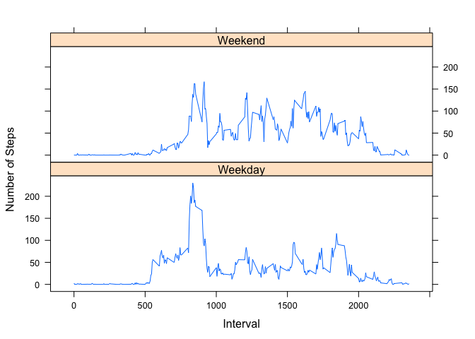

# Reproducible Research: Peer Assessment 1


## Loading and preprocessing the data

```r
activity <- read.table("activity.csv", header = TRUE, sep = ",", colClasses = c("integer","Date","integer"))
activity <- activity[complete.cases(activity),]
# head(activity)
```

## Make a histogram of the total number of steps taken each day


```r
aggdata <- aggregate(steps ~ date, activity, sum)
hist(aggdata$steps, breaks=16, main="Steps per Day", xlab="steps")
```

 

## What is mean total number of steps taken per day?

```r
print(c("Mean total number of steps taken per day is ", mean(aggdata$steps)))
```

```
## [1] "Mean total number of steps taken per day is "
## [2] "10766.1886792453"
```

```r
print(c("Median total number of steps taken per day is ", median(aggdata$steps)))
```

```
## [1] "Median total number of steps taken per day is "
## [2] "10765"
```


## What is the average daily activity pattern?
### Make a time series plot (i.e. type = "l") of the 5-minute interval (x-axis) and the average number of steps taken, averaged across all days (y-axis)

```r
meandata <- aggregate(steps ~ interval, activity, mean)
tail(meandata)
```

```
##     interval     steps
## 283     2330 2.6037736
## 284     2335 4.6981132
## 285     2340 3.3018868
## 286     2345 0.6415094
## 287     2350 0.2264151
## 288     2355 1.0754717
```

```r
plot(meandata, type="l", xaxt = "n", xlab="Time", ylab="Average number of steps taken, averaged across all days")
axis(1, at=c(0, 500, 1000, 1500, 2000), labels= c("00:00", "05:00", "10:00", "15:00", "20:00"))
```

 

### Which 5-minute interval, on average across all the days in the dataset, contains the maximum number of steps?

```r
maxdata <- aggregate(steps ~ interval, meandata, max)
maxdata[maxdata$steps == max(maxdata$steps), ]
```

```
##     interval    steps
## 104      835 206.1698
```
##### At 8:35, this indivisual takes the max number of steps of 206.17"


## Imputing missing values

#### Calculate and report the total number of missing values in the dataset (i.e. the total number of rows with NAs)

```r
activity2 <- read.table("activity.csv", header = TRUE, sep = ",", colClasses = c("integer","Date","integer"))
sum(!complete.cases(activity2))
```

```
## [1] 2304
```
#### Devise a strategy for filling in all of the missing values in the dataset. The strategy does not need to be sophisticated. For example, you could use the mean/median for that day, or the mean for that 5-minute interval, etc.
# Use the mean for a given inernal to fill all the NAs in steps

#### Create a new dataset that is equal to the original dataset but with the missing data filled in.

```r
# head(activity2)
# head(meandata)
library(dplyr)
```

```
## 
## Attaching package: 'dplyr'
## 
## The following object is masked from 'package:stats':
## 
##     filter
## 
## The following objects are masked from 'package:base':
## 
##     intersect, setdiff, setequal, union
```

```r
joinactivity <- left_join(activity2,meandata,by="interval")
head(joinactivity)
```

```
##   interval steps.x       date   steps.y
## 1        0      NA 2012-10-01 1.7169811
## 2        5      NA 2012-10-01 0.3396226
## 3       10      NA 2012-10-01 0.1320755
## 4       15      NA 2012-10-01 0.1509434
## 5       20      NA 2012-10-01 0.0754717
## 6       25      NA 2012-10-01 2.0943396
```

```r
joinactivity$Steps_new <- joinactivity$steps.x
my.na <- is.na(joinactivity$steps.x)
joinactivity$Steps_new[my.na] <- joinactivity$steps.y[my.na]
newdata <- joinactivity[,c("Steps_new","date", "interval")]
head(newdata)
```

```
##   Steps_new       date interval
## 1 1.7169811 2012-10-01        0
## 2 0.3396226 2012-10-01        5
## 3 0.1320755 2012-10-01       10
## 4 0.1509434 2012-10-01       15
## 5 0.0754717 2012-10-01       20
## 6 2.0943396 2012-10-01       25
```
#### Make a histogram of the total number of steps taken each day and Calculate and report the mean and median total number of steps taken per day. Do these values differ from the estimates from the first part of the assignment? What is the impact of imputing missing data on the estimates of the total daily number of steps?


```r
newdatahist <- aggregate(Steps_new ~ date, newdata, sum)
hist(newdatahist$Steps_new, breaks=16, main="Steps per Day", xlab="steps")
```

 

```r
print(c("Mean total number of steps taken per day is ", mean(newdatahist$Steps_new)))
```

```
## [1] "Mean total number of steps taken per day is "
## [2] "10766.1886792453"
```

```r
print(c("Median total number of steps taken per day is ", median(newdatahist$Steps_new)))
```

```
## [1] "Median total number of steps taken per day is "
## [2] "10766.1886792453"
```


#### Are there differences in activity patterns between weekdays and weekends?
#### For this part the weekdays() function may be of some help here. Use the dataset with the filled-in missing values for this part.

####  Create a new factor variable in the dataset with two levels – “weekday” and “weekend” indicating whether a given date is a weekday or weekend day.

```r
# test <- weekdays(newdatahist$date)
# weekends <- subset(newdatahist, weekdays(newdatahist$date) == "Saturday" | weekdays(newdatahist$date) == "Sunday")
# head(weekends)
# weekdays <- subset(newdatahist, weekdays(newdatahist$date) != "Saturday" & weekdays(newdatahist$date) != "Sunday")
# head(weekdays)


newdata$day_of_the_week <- as.factor(ifelse(weekdays(newdata$date) %in% c("Saturday","Sunday"), "Weekend", "Weekday")) 
weekends <- newdata[newdata$day_of_the_week == "Weekend",] 
head(weekends)
```

```
##      Steps_new       date interval day_of_the_week
## 1441         0 2012-10-06        0         Weekend
## 1442         0 2012-10-06        5         Weekend
## 1443         0 2012-10-06       10         Weekend
## 1444         0 2012-10-06       15         Weekend
## 1445         0 2012-10-06       20         Weekend
## 1446         0 2012-10-06       25         Weekend
```

```r
weekends_df <- aggregate(Steps_new ~ interval, data=weekends, mean)
head(weekends_df)
```

```
##   interval   Steps_new
## 1        0 0.214622642
## 2        5 0.042452830
## 3       10 0.016509434
## 4       15 0.018867925
## 5       20 0.009433962
## 6       25 3.511792453
```

```r
plot(weekends_df$interval, weekends_df$Steps_new, data=weekends_df, type="l")
```

```
## Warning in plot.window(...): "data" is not a graphical parameter
```

```
## Warning in plot.xy(xy, type, ...): "data" is not a graphical parameter
```

```
## Warning in axis(side = side, at = at, labels = labels, ...): "data" is not
## a graphical parameter
```

```
## Warning in axis(side = side, at = at, labels = labels, ...): "data" is not
## a graphical parameter
```

```
## Warning in box(...): "data" is not a graphical parameter
```

```
## Warning in title(...): "data" is not a graphical parameter
```

 
####  Make a panel plot containing a time series plot (i.e. type = "l") of the 5-minute interval (x-axis) and the average number of steps taken, averaged across all weekday days or weekend days (y-axis). See the README file in the GitHub repository to see an example of what this plot should look like using simulated data.

```r
require(lattice)
```

```
## Loading required package: lattice
```

```r
df <-aggregate(newdata$Steps_new ~ newdata$interval + newdata$day_of_the_week, data = newdata, FUN="mean")
colnames(df) <- c("interval","day_of_the_week", "Steps_new")
xyplot(df$Steps_new ~ df$interval | df$day_of_the_week, data=df, type="l", xlab= "Interval", ylab="Number of Steps", layout=c(1,2))
```

 
